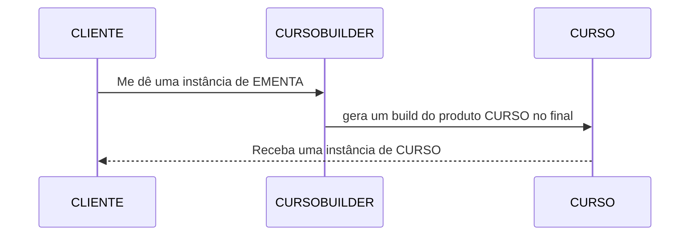
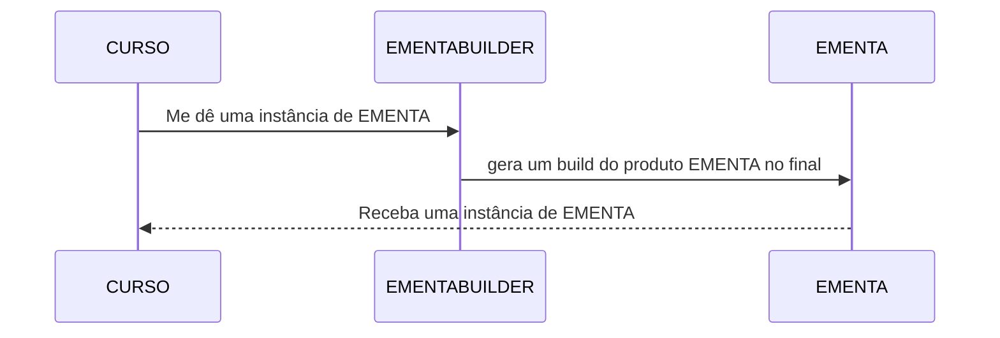

# TODO

## QUESTÃO UM
**PROGRESSO: 100%**
Obs: (De acordo com a questão 3, precisarem ter um controle de carga horário cursada para cada instância de curso?)

## QUESTÃO DOIS
**PROGRESSO: 60%**
Vamos precisar de um Builder pro curso:
- métodos que retornam `this`
- método build
- método `gerarEmenta()` que aplique a técnica builder para gerar um objeto do tipo EMENTA

implementar um objeto IMENTABUILDER que:
- deverá ser chamado dentro do CURSO concreto
- receba as váriaveis do CURSO
- passe esses valores para as váriaveis deste objeto através do builder
- retorne um objeto tipo ementa para classe curso
- Definir se será retornada uma EMENTA para o CLIENT ou para CURSO e este fará o `sysout`
- 

### Diagrama CURSO BUILDER:

### Diagrama EMENTA BUILDER:

## QUESTÃO TRÊS
**PROGRESSO: 0%**

