# TODO

## QUESTÃO UM
**PROGRESSO: 100%**
Obs: (De acordo com a questão 3, precisarem ter um controle de carga horário cursada para cada instância de curso?)

## QUESTÃO DOIS
**PROGRESSO: 90%**
Vamos precisar de um Builder pro curso:
- métodos que retornam `this` (FEITO)
- método build (FEITO)
- método `gerarEmenta()` que aplique a técnica builder para gerar um objeto do tipo EMENTA (FEITO)

Implementar um objeto IMENTABUILDER que:
- deverá ser chamado dentro do CURSO concreto (FEITO)
- receba as váriaveis do CURSO (FEITO)
- passe esses valores para as váriaveis deste objeto através do builder (FEITO)
- retorne um objeto tipo ementa para classe curso (FEITO)
- Definir se será retornada uma EMENTA para o CLIENT ou para CURSO e este fará o `sysout` (FEITO)

**Verificar se os prerequisitos da questão foram atendidos.**

### Diagrama CURSO BUILDER:

```mermaid
sequenceDiagram
CLIENTE ->> CURSOBUILDER: Me dê uma instância de EMENTA
CURSOBUILDER ->> CURSO: gera um build do produto CURSO no final
CURSO-->>CLIENTE : Receba uma instância de CURSO
```

### Diagrama EMENTA BUILDER:

```mermaid
sequenceDiagram
CURSO->> EMENTABUILDER: Me dê uma instância de EMENTA
EMENTABUILDER->> EMENTA: gera um build do produto EMENTA no final
EMENTA-->>CURSO: Receba uma instância de EMENTA
```

## QUESTÃO TRÊS
**PROGRESSO: 70%**

Implementar um objeto IMENTABUILDER que:
- Seja montado num singleton (FEITO)
- Checar se é possível criar outra instância de fora 
- Implementar método de busca e retorno de determinado curso (FEITO)
- Retornar um prótipo do curso
- Verificar como é implementado a questão da carga horária cursada

**Verificar se os prerequisitos da questão foram atendidos.**