# TODO

## QUESTÃO UM
**PROGRESSO: 100%**

Obs: (De acordo com a questao 3, precisaremos ter um controle de carga horaria cursada para cada instancia de curso?)

## QUESTÃO DOIS
**PROGRESSO: 90%**

Vamos precisar de um Builder pro curso:
- <strike>metodos que retornam `this`</strike>
- <strike>metodos build</strike>
- <strike>metodos `gerarEmenta()` que aplique a tecnica builder para gerar um objeto do tipo EMENTA</strike>

Implementar um objeto IMENTABUILDER que:
- <strike>devera ser chamado dentro do CURSO concreto</strike>
- <strike>receba as variaveis do CURSO</strike>
- <strike>passe esses valores para as variaveis deste objeto atraves do builder</strike>
- <strike>retorne um objeto tipo ementa para classe curso</strike>
- <strike>Definir se sera retornada uma EMENTA para o CLIENT ou para CURSO e este fara o `sysout`</strike>

**Verificar se os prerequisitos da questão foram atendidos.**

### Diagrama CURSO BUILDER:

```mermaid
sequenceDiagram
CLIENTE ->> CURSOBUILDER: Me dê uma instância de EMENTA
CURSOBUILDER ->> CURSO: gera um build do produto CURSO no final
CURSO-->>CLIENTE : Receba uma instância de CURSO
```

### Diagrama EMENTA BUILDER:

```mermaid
sequenceDiagram
CURSO->> EMENTABUILDER: Me dê uma instância de EMENTA
EMENTABUILDER->> EMENTA: gera um build do produto EMENTA no final
EMENTA-->>CURSO: Receba uma instância de EMENTA
```

## QUESTÃO TRÊS
**PROGRESSO: 70%**

Implementar um objeto IMENTABUILDER que:
- <strike>Seja montado num singleton</strike>
- Checar se é possível criar outra instância de fora 
- <strike>Implementar método de busca e retorno de determinado curso</strike>
- Retornar um prótipo do curso
- Verificar como é implementada a questão da carga horária cursada

**Verificar se os prerequisitos da questão foram atendidos.**
